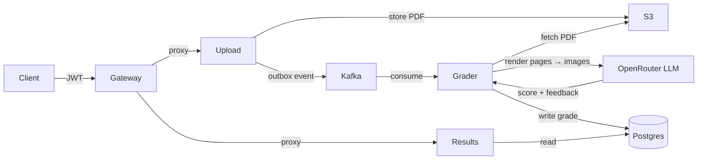
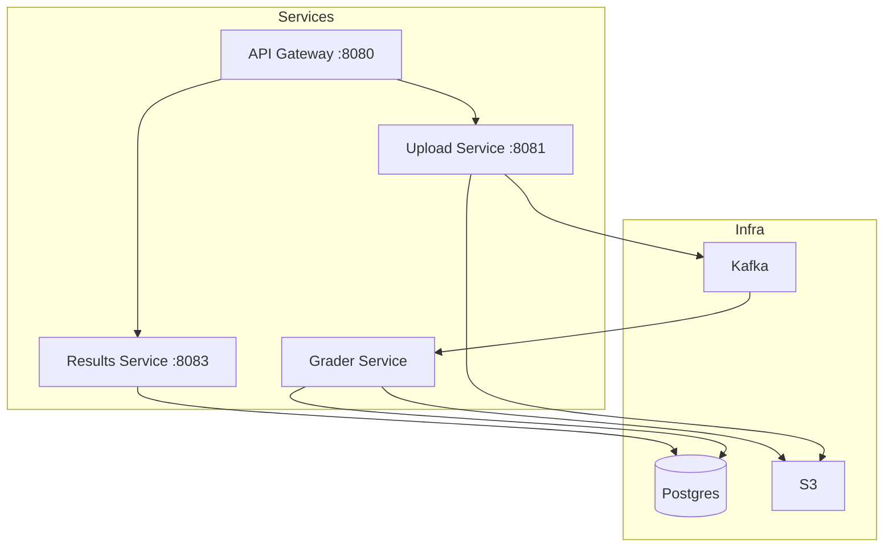

# AI Paper Grader

Upload a student's answer sheet (PDF), get back an AI-generated score and structured feedback — automatically.

Built with Go. Designed around a microservices architecture with async grading via Kafka and vision-based LLM evaluation.

---

## How it works



1. Client uploads a PDF through the gateway
2. Upload service stores it in S3 and fires a `paper.uploaded` Kafka event via the **outbox pattern**
3. Grader service picks it up, renders each PDF page to an image, and sends them to an OpenRouter vision LLM with the rubric
4. Score and structured feedback land in Postgres
5. Client polls `/results` to get the grade

---

## Architecture



| Service | Role |
|---|---|
| API Gateway | Auth, JWT validation, reverse proxy to internal services |
| Upload Service | Accepts PDFs, validates, stores to S3, writes outbox event |
| Grader Service | Kafka consumer — renders PDF pages, calls vision LLM, saves grade |
| Results Service | Read-only API for submission status and grades |

---

## Tech stack

- **Go** — all services
- **PostgreSQL** (pgx) — submissions, grades, outbox table
- **Kafka** — async decoupling between upload and grading
- **AWS S3** — PDF storage
- **OpenRouter** — vision LLM (sends rendered page images + rubric)
- **go-fitz** — PDF → image rendering
- **JWT** — access + refresh token auth
- **Docker Compose** — local infra

---

## Design decisions worth noting

**Outbox pattern** — instead of publishing directly to Kafka after a DB write (two-phase risk), the upload service writes an event row in the same transaction. A background publisher polls and forwards to Kafka. No lost events on crash.

**Vision-based grading** — PDF pages are rendered to PNG images and sent as base64 to the LLM. This handles handwritten answers, diagrams, and non-selectable text naturally.

**Single gateway** — auth lives in one place. Internal services trust the forwarded request; they don't re-validate JWTs.

---

## Running locally

```bash
# 1. Start infra
docker compose up -d postgres zookeeper kafka

# 2. Migrate
docker exec -i ai-grader-db psql -U ai-grader -d ai_grader < migrations/001_schema.sql

# 3. Copy and fill env
cp .env.example .env

# 4. Run services (separate terminals)
go run ./cmd/api
go run ./cmd/upload
go run ./cmd/grader
go run ./cmd/results
```

**Required env vars:** `DATABASE_URL`, `JWT_SECRET`, `AWS_*`, `S3_BUCKET_NAME`, `OPENROUTER_API_KEY`, `GLOBAL_GRADING_RUBRIC`

---

## API

```
POST /auth/register
POST /auth/login
POST /auth/refresh

POST /upload              # multipart/form-data — pdf + optional answer_scheme
GET  /results             # list user's submissions
GET  /results/:id         # single result with score + feedback
```

All `/upload` and `/results` routes require `Authorization: Bearer <token>`.
